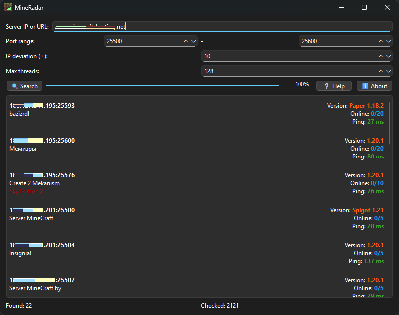

#  MineRadar


Minecraft server finder/scanner written in Python inspired by Wurst Client ServerFinder.



## Installation

### Requirements
- Python 3.9+
- PyQt6
- mcstatus

### Install requirements
```bash
pip install PyQt6 msctatus
```

## Running
Launch **MineRadar.pyw** or run `python MineRadar.pyw`
Windows binaries are available in Releases
