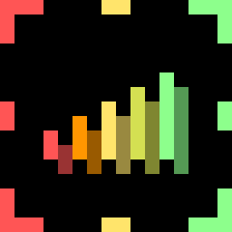

import GithubButton from 'vue-github-button'
<github-button href="https://github.com/Myp3xx/MineRadar" data-color-scheme="no-preference: light; light: light; dark: dark;" data-icon="octicon-star" data-size="large" aria-label="Star Myp3xx/MineRadar on GitHub">Star</github-button>

#  MineRadar
Minecraft server finder/scanner written in Python inspired by Wurst Client ServerFinder.


## Installation

### Requirements
- Python 3.9+
- PyQt6
- mcstatus

### Install requirements
```bash
pip install PyQt6 msctatus
```

## Running
Launch **MineRadar.pyw** or run `python MineRadar.pyw`
